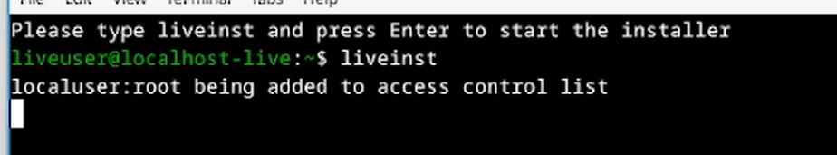
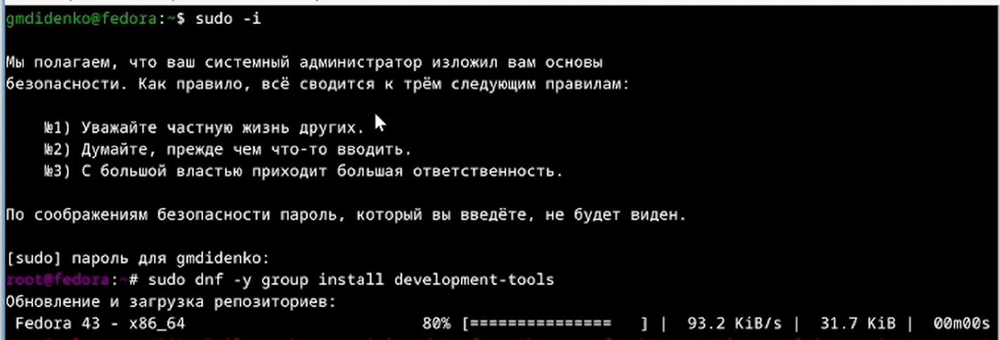
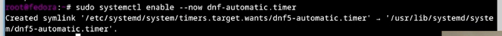
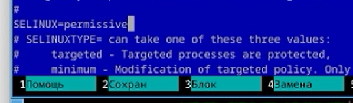
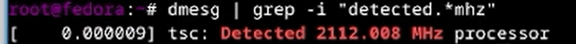
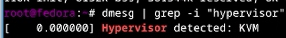

---
## Author
author:
  name: Диденко Герман Максимович
  degrees: DSc
  orcid: 0000-0002-0877-7063
  email: 1032253558@rudn.ru
  affiliation:
    - name: Российский университет дружбы народов
      country: Российская Федерация
      postal-code: 117198
      city: Москва
      address: ул. Миклухо-Маклая, д. 6
## Title
title: Лабораторная работа №1
subtitle: Установка Linux Fedora
license: CC BY
date: today
date-format: "YYYY-MM-DD"
---

# Информация

## Докладчик

:::::::::::::: {.columns align=center}
::: {.column width="70%"}

  * Диденко Герман Максимович
  * НКАбд-02-25
  * Российский университет дружбы народов им. П. Лумумбы
  * [1032253558@rudn.ru](1032253558@rudn.ru)

:::
::: {.column width="30%"}

:::
::::::::::::::

# Цель работы

Целью данной работы является приобретение практических навыков установки операционной системы на виртуальную машину, настройки минимально необходимых для дальнейшей работы сервисов.

---

# Задание

- Создание виртуальной машины
- Первоначальная настройка ОС для дальнейшей работы
- Установка инструментов для работы

---

# Теоретическое введение

**VirtualBox** — программа для виртуализации различных операционных систем
**Fedora** — дистрибутив Linux от компании Red Hat.

---

# Создание виртуальной машины

Я создаю образ Linux Fedora на VirtualBox. Настраиваю имя (fedor), кол-во ядер, кол-во памяти, также выделяю место на диске.

{width=70%}

После загрузки, нажимаю комбинацию Win+Enter и вводу `liveinst`

{width=70%}

Вводу имя пользователя, пароль для пользователя (также для root) и жду установку

{width=70%}

# Настройка среды

После установки, перехожу на супер-пользователя для установки программ и установливаю средства разработки

{width=70%}

Установливаю средства программного обеспечения

{width=70%}

Запускаю таймер

{width=70%}

Отключаю SELinux

{width=70%}

Настраиваю раскладку клавиатуры

{width=70%}

Настраиваю раскладку клавиатуры

{width=70%}

Редактирую конфиг под раскладку клавиатуры

{width=70%}

Устанавливаю pandoc

{width=70%}

Устанавливаю TeXlive

{width=70%}

# Домашнее задание

Получаю версию ядра Linux (Linux version).

{width=70%}

Частота процессора (Detected Mhz processor).

{width=70%}

Модель процессора (CPU0).

{width=70%}

Объём доступной оперативной памяти (Memory available).

{width=70%}

Тип обнаруженного гипервизора (Hypervisor detected).

{width=70%}

Тип файловой системы корневого раздела и последовательность монтирования файловых систем.

{width=70%}

# Выводы
В ходе выполнения лабораторный работы приборел навыки установки виртуальной машины на VirtualBox, установил ряд пакетов и настроил ОС для дальнейшей работы на ней.