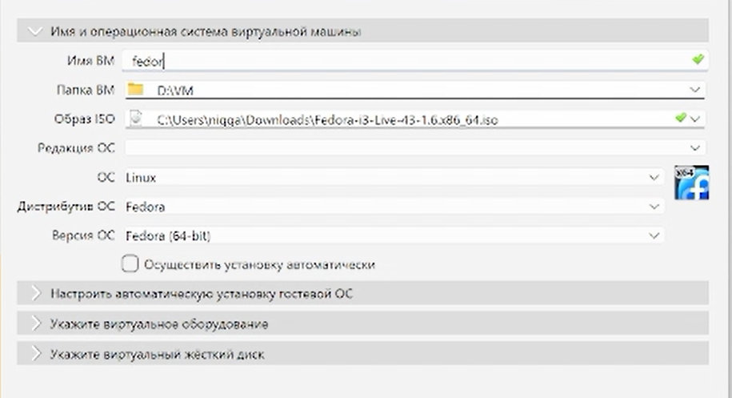

---
## Author
author:
<<<<<<< HEAD
  name: Дмитрий Сергеевич Кулябов
  degrees: DSc
  orcid: 0000-0002-0877-7063
  email: kulyabov-ds@rudn.ru
=======
  name: Диденко Герман Максимович
>>>>>>> 4628cf3 (add report)
  affiliation:
    - name: Российский университет дружбы народов
      country: Российская Федерация
      postal-code: 117198
      city: Москва
      address: ул. Миклухо-Маклая, д. 6
<<<<<<< HEAD

## Title
title: "Шаблон отчёта по лабораторной работе"
subtitle: "Простейший вариант"
license: "CC BY"
---

# Цель работы

Здесь приводится формулировка цели лабораторной работы.
Формулировки цели для каждой лабораторной работы приведены в методических указаниях.

Цель данного шаблона --- максимально упростить подготовку отчётов по лабораторным работам.
Модифицируя данный шаблон, студенты смогут без труда подготовить отчёт по лабораторным работам, а также познакомиться с основными возможностями разметки Markdown.

# Задание

Здесь приводится описание задания в соответствии с рекомендациями методического пособия и выданным вариантом.

# Теоретическое введение

Здесь описываются теоретические аспекты, связанные с выполнением работы.

Например, в [табл. @tbl-std-dir] приведено краткое описание стандартных каталогов Unix.

| Имя каталога | Описание каталога                                                                                                          |
|--------------|----------------------------------------------------------------------------------------------------------------------------|
| `/`          | Корневая директория, содержащая всю файловую                                                                               |
| `/bin `      | Основные системные утилиты, необходимые как в однопользовательском режиме, так и при обычной работе всем пользователям     |
| `/etc`       | Общесистемные конфигурационные файлы и файлы конфигурации установленных программ                                           |
| `/home`      | Содержит домашние директории пользователей, которые, в свою очередь, содержат персональные настройки и данные пользователя |
| `/media`     | Точки монтирования для сменных носителей                                                                                   |
| `/root`      | Домашняя директория пользователя  `root`                                                                                   |
| `/tmp`       | Временные файлы                                                                                                            |
| `/usr`       | Вторичная иерархия для данных пользователя                                                                                 |

: Описание некоторых каталогов файловой системы GNU Linux {#tbl-std-dir}

Более подробно про Unix см. в [@tanenbaum_book_modern-os_ru; @robbins_book_bash_en; @zarrelli_book_mastering-bash_en; @newham_book_learning-bash_en].

# Выполнение лабораторной работы

Описываются проведённые действия, в качестве иллюстрации даётся ссылка на иллюстрацию ([рис. @fig-001]).

{#fig-001 width=70%}

# Выводы

Здесь кратко описываются итоги проделанной работы.

# Список литературы{.unnumbered}

::: {#refs}
:::
=======
lang: ru
format:
  pdf:
    documentclass: scrartcl
    latex-engine: xelatex
    mainfont: "Liberation Serif"
    sansfont: "Liberation Sans"
    monofont: "Liberation Mono"
    include-in-header:
      text: |
        \usepackage{fontspec}
        \setmainfont{Liberation Serif}
        \setsansfont{Liberation Sans}
        \setmonofont{Liberation Mono}
  pptx:
    toc: false
## Title
title: Лабораторная работа №1
subtitle: Установка Linux Fedora на VirtualBox
license: CC BY
---

# Содержание 
1) Цель работы
2) Задание
3) Теоретическое введение
4) Выполнение лабораторной работы
5) Ответы на контрольные вопросы
6) Выводы 
7) Список литературы 

---


# Цель работы

Целью данной работы является приобретение практических навыков установки операционной системы на виртуальную машину, настройки минимально необходимых для дальнейшей работы сервисов.

---

# Задание

1. Установка системы на диск
2. Установка необходимого ПО
3. Первоначальная настройка ОС для дальнейшей работы
4. Установка инструментов для работы

---

# Теоретическое введение

**VirtualBox** — программа для виртуализации различных операционных систем
**Fedora** — дистрибутив Linux от компании Red Hat.

---

# Выполнение лабораторной работы

## Шаг 1. Создание виртуальной машины

{width=70%}

---

## Шаг 2.

Для корректной работы виртуальной машины устанавливаю Guest Additions:

{width=70%}
---

---

# Контрольные вопросы

## 1. Какую информацию содержит учётная запись пользователя?

Учётная запись содержит:
- Имя пользователя (login/username)
- UID (идентификатор пользователя)
- GID (идентификатор группы)
- Домашний каталог
- Оболочку по умолчанию (bash, zsh, etc.)
- Зашифрованный пароль

---

## 2. Укажите команды терминала и приведите примеры

| Назначение | Команда | Пример |
|------------|---------|--------|
| Справка по команде | `man` | `man ls` |
| Перемещение по файловой системе | `cd` | `cd /home/user` |
| Просмотр содержимого каталога | `ls` | `ls -la` |
| Определение объёма каталога | `du` | `du -sh /var` |
| Создание каталогов | `mkdir` | `mkdir test` |
| Удаление каталогов | `rmdir` | `rmdir test` |
| Создание файлов | `touch` | `touch file.txt` |
| Удаление файлов | `rm` | `rm file.txt` |
| Задание прав на файл | `chmod` | `chmod 755 script.sh` |
| Просмотр истории команд | `history` | `history \| grep git` |

---

## 3. Что такое файловая система? Приведите примеры с краткой характеристикикой

**Файловая система** — способ организации и хранения данных на носителях информации.

| Файловая система | Характеристика |
|------------------|----------------|
| **ext4** | Стандартная для Linux, надёжная, поддерживает журналирование |
| **xfs** | Высокая производительность, используется в RHEL/CentOS/Fedora |
| **NTFS** | Стандартная для Windows, поддерживает большие файлы |
| **FAT32** | Совместима со всеми ОС, не поддерживает файлы >4 ГБ |
| **Btrfs** | Современная ФС с поддержкой снимков (snapshots) |

---

## 4. Как посмотреть, какие файловые системы подмонтированы в ОС?

```bash
# Показать все смонтированные файловые системы
mount

# Или в более читаемом формате
df -h

# Или с типом файловой системы
df -T
```

## 5. Как удалить зависший процесс?
```bash
# Найти PID процесса
ps aux | grep имя_процесса

# Завершить процесс мягко
kill PID

# Завершить процесс принудительно
kill -9 PID

# Или по имени процесса
killall имя_процесса

# Интерактивное завершение
top  # затем нажать 'k' и ввести PID
```
## 6. Что такое виртуальная машина?
Виртуальная машина — эмулируемая компьютерная система, которая предоставляет функциональность физического компьютера. Позволяет запускать несколько ОС на одном физическом компьютере.

## 7. Какие типы виртуализации вы знаете?
Аппаратная, Паравиртуализация, Контейнеризация.

## Выводы
В ходе выполнения лабораторной работы были приобретены следующие навыки:

1) Установка операционной системы Linux Fedora на VirtualBox
2) Настройка виртуальной машины
4) Установка необходимого программного обеспечения для разработки
5) Базовая настройка операционной системы для дальнейшей работы
9) Сбор информации о системе

---

# Список литературы

1) Dash P. Getting Started with Oracle VM VirtualBox. — Packt Publishing Ltd, 2013. — 86 с.
2) Colvin H. VirtualBox: An Ultimate Guide Book on Virtualization with VirtualBox. — CreateSpace Independent Publishing Platform, 2015. — 70 с.
3) Немет Э., Шнайдер Г., Хейн Т.Р., Уэйли Б. Unix и Linux: руководство системного администратора. — 4-е изд. — Вильямс, 2014. — 1312 с.
4) Колесниченко Д.Н. Самоучитель системного администратора Linux. — Санкт-Петербург: БХВ-Петербург, 2011. — 544 с.
5) Официальная документация Fedora. — https://docs.fedoraproject.org/
6) Официальная документация VirtualBox. — https://www.virtualbox.org/manual/
>>>>>>> 4628cf3 (add report)
