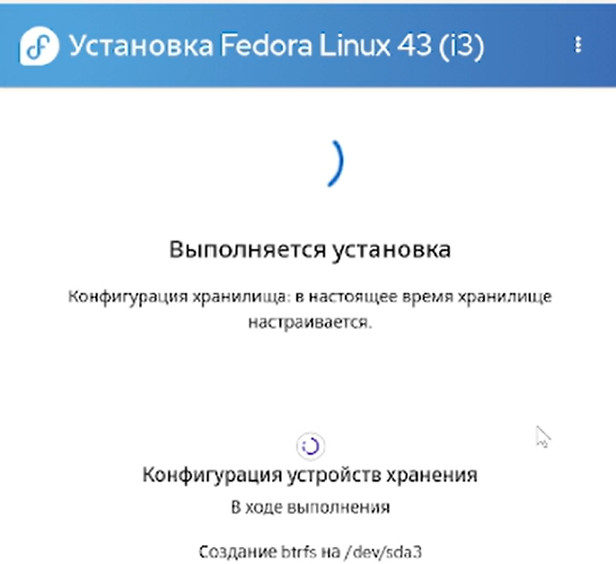
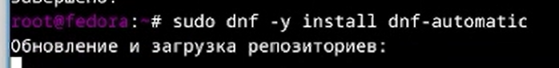
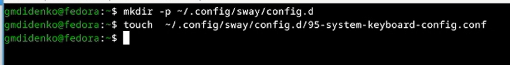
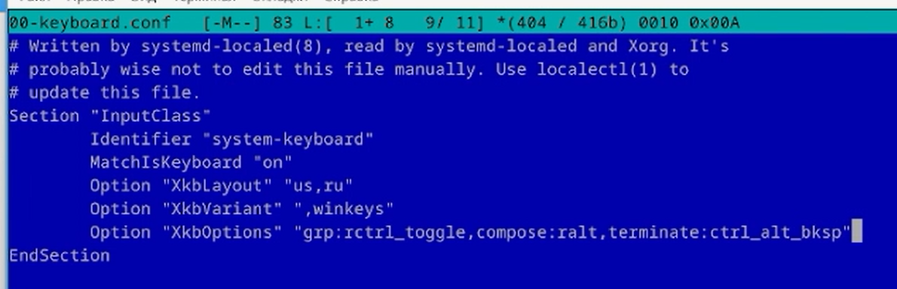
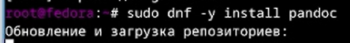
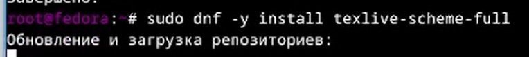
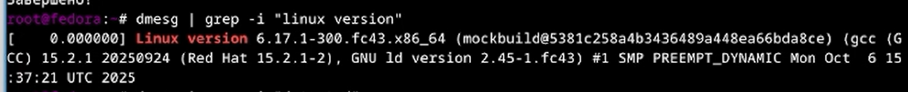
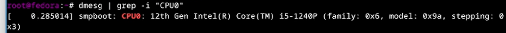
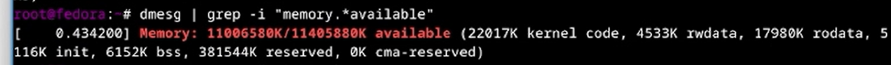
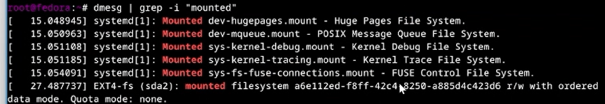

---
## Author
author:
  name: "Диденко Герман Максимович"
  affiliation:
    - name: "Российский университет дружбы народов"
      country: "Российская Федерация"
      postal-code: "117198"
      city: "Москва"
      address: "ул. Миклухо-Маклая, д. 6"

## Title
title: "Лабораторная работа №1"
subtitle: "Установка Linux Fedora на VirtualBox"
license: "CC BY"
---

---

# Цель работы

Целью данной работы является приобретение практических навыков установки операционной системы на виртуальную машину, настройки минимально необходимых для дальнейшей работы сервисов.

---

# Задание

- Создание виртуальной машины
- Первоначальная настройка ОС для дальнейшей работы
- Установка инструментов для работы

---

# Теоретическое введение

**VirtualBox** — программа для виртуализации различных операционных систем
**Fedora** — дистрибутив Linux от компании Red Hat.

---

# Выполнение лабораторной работы

Я создаю образ Linux Fedora на VirtualBox. Настраиваю имя (fedor), кол-во ядер, кол-во памяти, также выделяю место на диске.

## Создание виртуальной машины

{width=70%}

После загрузки, нажимаю комбинацию Win+Enter и вводу `liveinst`

{width=70%}

Вводу имя пользователя, пароль для пользователя (также для root) и жду установку

{width=70%}

---

## Настройка среды

После установки, перехожу на супер-пользователя для установки программ и установливаю средства разработки

{width=70%}

Установливаю средства программного обеспечения

{width=70%}

Запускаю таймер

{width=70%}

Отключаю SELinux

{width=70%}

Настраиваю раскладку клавиатуры

{width=70%}

Настраиваю раскладку клавиатуры

{width=70%}

Редактирую конфиг под раскладку клавиатуры

{width=70%}

Устанавливаю pandoc

{width=70%}

Устанавливаю TeXlive

{width=70%}

---

## Домашнее задание

Получаю версию ядра Linux (Linux version).

{width=70%}

Частота процессора (Detected Mhz processor).

{width=70%}

Модель процессора (CPU0).

{width=70%}

Объём доступной оперативной памяти (Memory available).

{width=70%}

Тип обнаруженного гипервизора (Hypervisor detected).

{width=70%}

Тип файловой системы корневого раздела и последовательность монтирования файловых систем.

{width=70%}

---

# Контрольные вопросы

## 1. Какую информацию содержит учётная запись пользователя?

Учётная запись содержит:
- Имя пользователя (login/username)
- UID (идентификатор пользователя)
- GID (идентификатор группы)
- Домашний каталог
- Оболочку по умолчанию (bash, zsh, etc.)
- Зашифрованный пароль

---

## 2. Укажите команды терминала и приведите примеры

| Назначение | Команда | Пример |
|------------|---------|--------|
| Справка по команде | `man` | `man ls` |
| Перемещение по файловой системе | `cd` | `cd /home/user` |
| Просмотр содержимого каталога | `ls` | `ls -la` |
| Определение объёма каталога | `du` | `du -sh /var` |
| Создание каталогов | `mkdir` | `mkdir test` |
| Удаление каталогов | `rmdir` | `rmdir test` |
| Создание файлов | `touch` | `touch file.txt` |
| Удаление файлов | `rm` | `rm file.txt` |
| Задание прав на файл | `chmod` | `chmod 755 script.sh` |
| Просмотр истории команд | `history` | `history \| grep git` |

---

## 3. Что такое файловая система? Приведите примеры с краткой характеристикикой

**Файловая система** — способ организации и хранения данных на носителях информации.

| Файловая система | Характеристика |
|------------------|----------------|
| **ext4** | Стандартная для Linux, надёжная, поддерживает журналирование |
| **xfs** | Высокая производительность, используется в RHEL/CentOS/Fedora |
| **NTFS** | Стандартная для Windows, поддерживает большие файлы |
| **FAT32** | Совместима со всеми ОС, не поддерживает файлы >4 ГБ |
| **Btrfs** | Современная ФС с поддержкой снимков (snapshots) |

---

## 4. Как посмотреть, какие файловые системы подмонтированы в ОС?

```bash
# Показать все смонтированные файловые системы
mount

# Или в более читаемом формате
df -h

# Или с типом файловой системы
df -T
```

## 5. Как удалить зависший процесс?
```bash
# Найти PID процесса
ps aux | grep имя_процесса

# Завершить процесс мягко
kill PID

# Завершить процесс принудительно
kill -9 PID

# Или по имени процесса
killall имя_процесса

# Интерактивное завершение
top  # затем нажать 'k' и ввести PID
```
## 6. Что такое виртуальная машина?
Виртуальная машина — эмулируемая компьютерная система, которая предоставляет функциональность физического компьютера. Позволяет запускать несколько ОС на одном физическом компьютере.

## 7. Какие типы виртуализации вы знаете?
Аппаратная, Паравиртуализация, Контейнеризация.

## Выводы
В ходе выполнения лабораторной работы были приобретены следующие навыки:

1) Установка операционной системы Linux Fedora на VirtualBox
2) Настройка виртуальной машины
4) Установка необходимого программного обеспечения для разработки
5) Базовая настройка операционной системы для дальнейшей работы
9) Сбор информации о системе

---

# Список литературы

1) Dash P. Getting Started with Oracle VM VirtualBox. — Packt Publishing Ltd, 2013. — 86 с.
2) Colvin H. VirtualBox: An Ultimate Guide Book on Virtualization with VirtualBox. — CreateSpace Independent Publishing Platform, 2015. — 70 с.
3) Немет Э., Шнайдер Г., Хейн Т.Р., Уэйли Б. Unix и Linux: руководство системного администратора. — 4-е изд. — Вильямс, 2014. — 1312 с.
4) Колесниченко Д.Н. Самоучитель системного администратора Linux. — Санкт-Петербург: БХВ-Петербург, 2011. — 544 с.
5) Официальная документация Fedora. — https://docs.fedoraproject.org/
6) Официальная документация VirtualBox. — https://www.virtualbox.org/manual/
