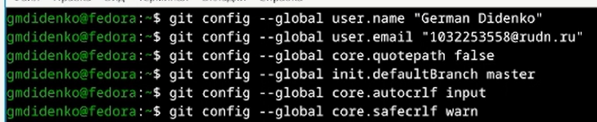
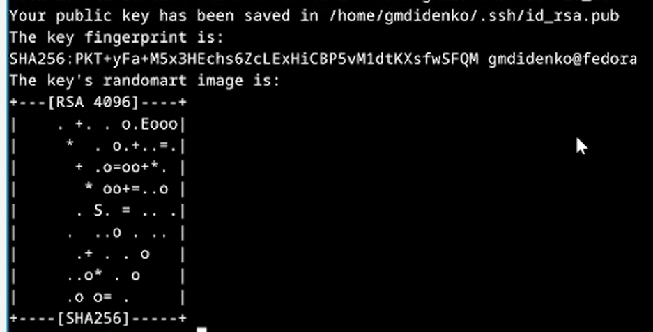
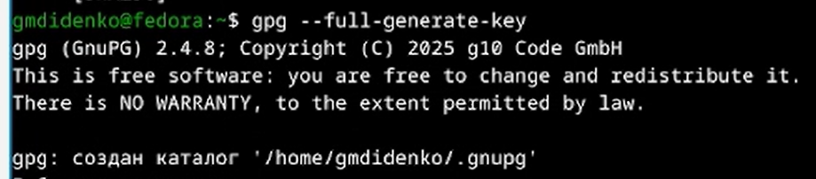
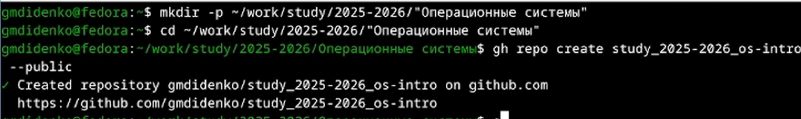

---
## Author
author:
  name: Диденко Герман Максимович
  degrees: DSc
  orcid: 0000-0002-0877-7063
  email: 1032253558@rudn.ru
  affiliation:
    - name: Российский университет дружбы народов
      country: Российская Федерация
      postal-code: 117198
      city: Москва
      address: ул. Миклухо-Маклая, д. 6
## Title
title: Лабораторная работа №2
subtitle: Установка Git и GH
license: CC BY
date: today
date-format: "YYYY-MM-DD"
---

# Информация

## Докладчик

:::::::::::::: {.columns align=center}
::: {.column width="70%"}

  * Диденко Герман Максимович
  * НКАбд-02-25
  * Российский университет дружбы народов им. П. Лумумбы
  * [1032253558@rudn.ru](1032253558@rudn.ru)

:::
::: {.column width="30%"}

:::
::::::::::::::

# Цель работы

Целью данной работы является изучить идеологию и применение средств контроля версий, освоить умения по работе с git.

# Задание

- Установка и настройка git.
- Ключи для авторизации
- Каталог для выполнения заданий по предмету

# Теоретическое введение

Системы контроля версий (Version Control System, VCS) применяются при работе нескольких человек над одним проектом. Обычно основное дерево проекта хранится в локальном или удалённом репозитории, к которому настроен доступ для участников проекта. При внесении изменений в содержание проекта система контроля версий позволяет их фиксировать, совмещать изменения, произведённые разными участниками проекта, производить откат к любой более ранней версии проекта, если это требуется.

# Настройка git и gh

Устанавливаю git и gh через root

{width=70%}

Делаю настройки для git

{width=70%}

Создаю ключ для авторизации

{width=70%}

Также создаю PGP ключ

{width=70%}

Вывожу fingerprint

{width=70%}

Ввожу ключ на Github

{width=70%}

Делаю настройку для git

{width=70%}

С помощью `gh auth login` авторизовываюсь на github

{width=70%}

Создаю репозиторий на своем github

{width=70%}

Создаю каталоги в репозиторие и загружаю их на Github

{width=70%}

# Выводы

В ходе выполнения лабораторной работы были приобретены следующие навыки работы с git, gh.
