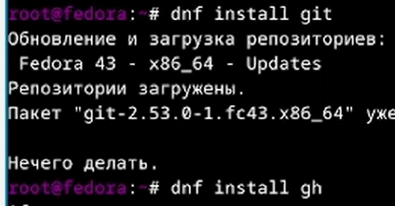
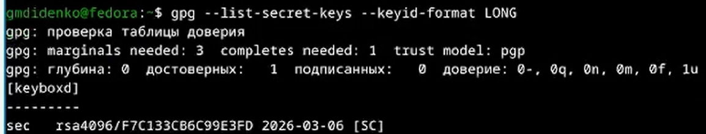
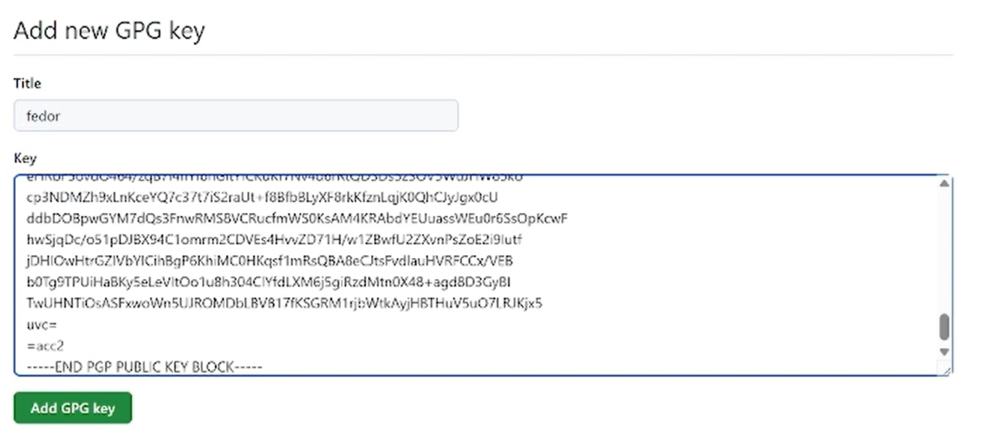
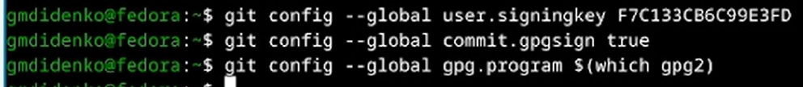
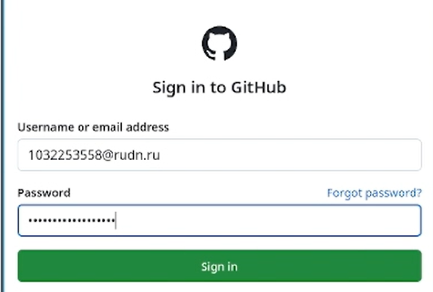
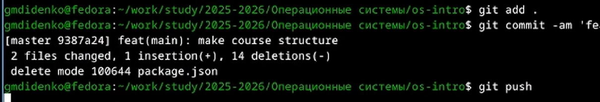

---
## Author
author:
  name: "Диденко Герман Максимович"
  affiliation:
    - name: "Российский университет дружбы народов"
      country: "Российская Федерация"
      postal-code: "117198"
      city: "Москва"
      address: "ул. Миклухо-Маклая, д. 6"

## Title
title: "Лабораторная работа №2"
subtitle: "Первоначальна настройка git"
license: "CC BY"
---

---

# Цель работы

Целью данной работы является изучить идеологию и применение средств контроля версий, освоить умения по работе с git.

---

# Задание

- Установка и настройка git.
- Ключи для авторизации
- Каталог для выполнения заданий по предмету

---

# Теоретическое введение

Системы контроля версий (Version Control System, VCS) применяются при работе нескольких человек над одним проектом. Обычно основное дерево проекта хранится в локальном или удалённом репозитории, к которому настроен доступ для участников проекта. При внесении изменений в содержание проекта система контроля версий позволяет их фиксировать, совмещать изменения, произведённые разными участниками проекта, производить откат к любой более ранней версии проекта, если это требуется.

---

# Выполнение лабораторной работы

## Настройка git и gh

Устанавливаю git и gh через root

{width=70%}

Делаю настройки для git

{width=70%}

Создаю ключ для авторизации

{width=70%}

Также создаю PGP ключ

{width=70%}

Вывожу fingerprint

{width=70%}

Ввожу ключ на Github

{width=70%}

Делаю настройку для git

{width=70%}

С помощью `gh auth login` авторизовываюсь на github

{width=70%}

Создаю репозиторий на своем github

{width=70%}

Создаю каталоги в репозиторие и загружаю их на Github

{width=70%}

---

# Контрольные вопросы

**1. Что такое система контроля версий?**  
Инструмент для фиксации изменений в файлах, позволяющий отслеживать историю, возвращаться к предыдущим версиям и совмещать правки разных авторов.

**2. Централизованные и распределённые VCS: в чём разница?**  
Централизованные (SVN) хранят историю на одном сервере; распределённые (Git) дают каждому участнику полную копию репозитория, позволяя работать офлайн.

**3. Для чего нужны `git add` и `git commit`?**  
`git add` — добавляет изменения в индекс (подготовка к коммиту); `git commit` — сохраняет изменения в локальную историю с комментарием.

**4. Зачем нужны SSH-ключи в Git?**  
Для безопасной аутентификации при подключении к удалённым репозиториям без ввода логина и пароля.

**5. Чем отличается PGP-подпись коммита?**  
Криптографически подтверждает авторство и целостность коммита; на GitHub такие коммиты помечаются как **Verified**.

**6. Что делает `git config --global`?**  
Записывает настройки в глобальный файл `~/.gitconfig`, применяя их ко всем репозиториям пользователя.

**7. Зачем нужен `core.autocrlf` и какое значение в Linux?**  
Управляет преобразованием символов конца строки. В Linux: `input` — конвертирует CRLF→LF при коммите, не меняет при checkout.

**8. Как проверить подпись коммита?**  
Локально: `git log --show-signature`; на GitHub — значок **Verified** рядом с коммитом.

**9. Что делает `git flow init`?**  
Инициализирует структуру веток Git Flow: создаёт `master`, `develop` и настраивает префиксы для `feature/`, `release/`, `hotfix/`.

**10. Как создать и отправить тег версии?**  
```bash
git tag -a v1.0.0 -m "Release"
git push origin v1.0.0
# или все теги:
git push --tags
```

# Выводы

В ходе выполнения лабораторной работы были приобретены следующие навыки работы с git, gh.

---

# Список литературы
1) Официальная документация Git. — URL: https://git-scm.com/doc (дата обращения: 2026)
2) GitHub Docs. — URL: https://docs.github.com (дата обращения: 2026)
3) Проктор Г. Git для профессионалов. — М.: ДМК Пресс, 2021. — 352 с.
4) Чакона С., Штрауб Б. Pro Git. 2-е изд. — М.: Питер, 2020. — 416 с.
5) Семантическое версионирование. — URL: https://semver.org/lang/ru/ (дата обращения: 2026)
6) Conventional Commits. — URL: https://www.conventionalcommits.org (дата обращения: 2026)
7) Pandoc User's Guide. — URL: https://pandoc.org/MANUAL.html (дата обращения: 2026)
8) ГОСТ 7.32-2001. Отчёт о научно-исследовательской работе. Структура и правила оформления.