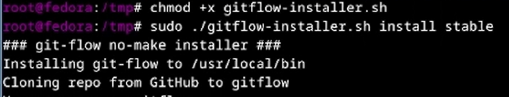
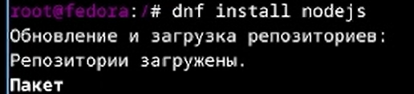
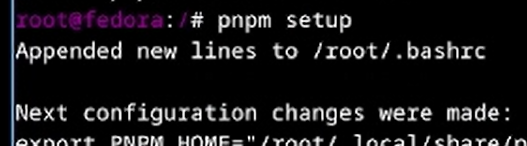
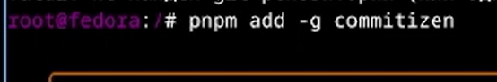
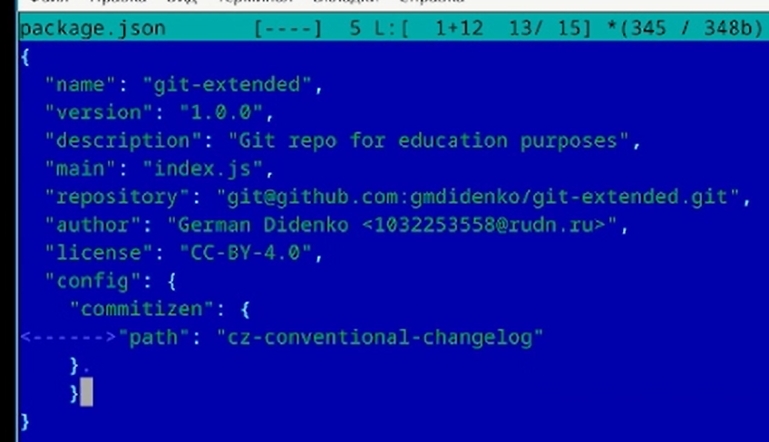
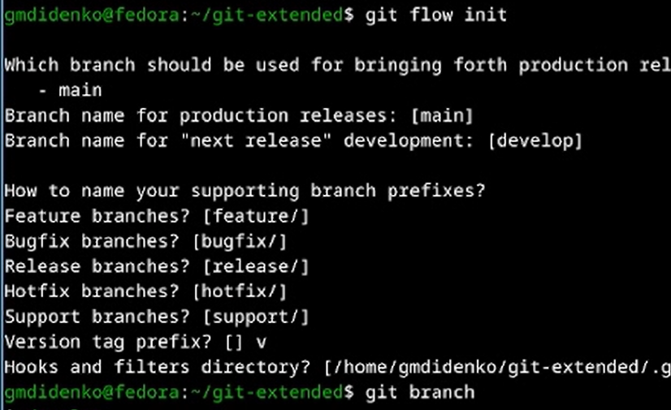
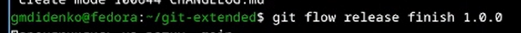
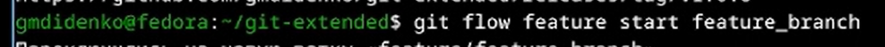

---
## Author
author:
  name: "Диденко Герман Максимович"
  affiliation:
    - name: "Российский университет дружбы народов"
      country: "Российская Федерация"
      postal-code: "117198"
      city: "Москва"
      address: "ул. Миклухо-Маклая, д. 6"

## Title
title: "Лабораторная работа №4"
subtitle: "Первоначальна настройка git"
license: "CC BY"
---

---

# Цель работы

Получение навыков правильной работы с репозиториями git

---

# Задание

- Установка Gitflow
- Установка и настойка Node.js
- Создание репозитория git

---

# Теоретическое введение

Gitflow Workflow предполагает выстраивание строгой модели ветвления с учётом выпуска проекта.
Версия задаётся в виде кортежа МАЖОРНАЯ_ВЕРСИЯ.МИНОРНАЯ_ВЕРСИЯ.ПАТЧ.

---

# Выполнение лабораторной работы

## Установка git-flow

Устанавливаю git-flow

{width=70%}

Устанавливаю node.js

{width=70%}

{width=70%}

Устанавливаем пакеты `commitizen` и `standard-changelog`

{width=70%}
{width=70%}

Создаем репозиторий git-extended

{width=70%}

Далее добавим в файл package.json команду для формирования коммитов

{width=70%}

Инициализируем git-flow

{width=70%}

Проверим, что мы на ветке develop, загрузим весь репозиторий в хранилище, установите внешнюю ветку как вышестоящую для этой ветки,
создадим релиз с версией 1.0.0 `git flow release start 1.0.0`, создадим журнал изменений, добавим журнал изменений в индекс, зальём релизную ветку в основную ветку

{width=70%}

Создадим ветку для новой функциональности:

{width=70%}

Отправим данные на github

{width=70%}

Создадим релиз с версией 1.2.3

{width=70%}

Обновите номер версии в файле package.json, установим её в 1.2.3, создадим журнал изменений, добавим журнал изменений в индекс, зальём релизную ветку в основную ветку

{width=70%}

---

# Выводы

В ходе выполнения лабораторной работы были приобретены следующие навыки работы с gitflow, node.js.

---

# Список литературы
1) Git Flow. — URL: https://github.com/nvie/gitflow (дата обращения: 2026)
2) Semantic Versioning 2.0.0. — URL: https://semver.org/lang/ru/ (дата обращения: 2026)
3) Conventional Commits. — URL: https://www.conventionalcommits.org (дата обращения: 2026)
4) Commitizen. — URL: https://github.com/commitizen/cz-cli (дата обращения: 2026)
5) Conventional Changelog. — URL: https://github.com/conventional-changelog/conventional-changelog (дата обращения: 2026)
6) GitHub CLI Manual. — URL: https://cli.github.com/manual/ (дата обращения: 2026)
7) Node.js Documentation. — URL: https://nodejs.org/docs (дата обращения: 2026)
8) ГОСТ 7.32-2001. Отчёт о научно-исследовательской работе. Структура и правила оформления.