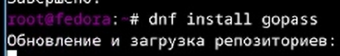
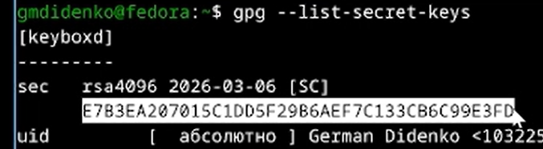
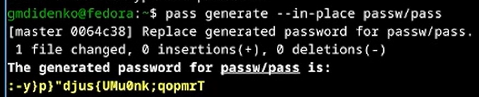

---
## Author
author:
  name: Диденко Герман Максимович
  degrees: DSc
  orcid: 0000-0002-0877-7063
  email: 1032253558@rudn.ru
  affiliation:
    - name: Российский университет дружбы народов
      country: Российская Федерация
      postal-code: 117198
      city: Москва
      address: ул. Миклухо-Маклая, д. 6
## Title
title: Лабораторная работа №4
subtitle: Gitflow
license: CC BY
date: today
date-format: "YYYY-MM-DD"
---

# Информация

## Докладчик

:::::::::::::: {.columns align=center}
::: {.column width="70%"}

  * Диденко Герман Максимович
  * НКАбд-02-25
  * Российский университет дружбы народов им. П. Лумумбы
  * [1032253558@rudn.ru](1032253558@rudn.ru)

:::
::: {.column width="30%"}

:::
::::::::::::::

# Цель работы

Настройка рабочей среды на виртуальной машине Fedora

# Задание

- Установка pass
- Установка и настойка программного обеспечения

# Теоретическое введение

Данные хранятся в файловой системе в виде каталогов и файлов.
Файлы шифруются с помощью GPG-ключа.

# Выполнение лабораторной работы

Устанавливаю pass и pass-otp

{width=70%}

Устанавливаю gopass

{width=70%}

Просмотр списка ключей

{width=70%}

Затем инициализируем хранилище с помощью pass init E7B3EA2070...

Создаем репозиторий browserpass

{width=70%}
{width=70%}

Добавляем новый пароль

{width=70%}

Заменяем существующий пароль

{width=70%}

Затем устанавливаем шрифты

{width=70%}

Далее с помощью wget устанавливаем chezmoi, подключаем репозиторий к своей системе с помощью chezmoi.
Обновляем файл ~/.config/chezmoi/chezmoi.toml, чтобы автоматически фиксировать и отправлять изменения в репозиторий

{width=70%}

# Выводы

В ходе выполнения лабораторной работы были приобретены следующие навыки работы с pass, chezmoi